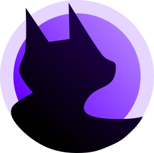
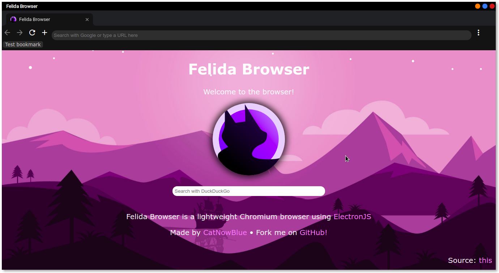

<h1 align="center">Felida Browser</h1>

  
  
  
  
  

 

# Features

  - #### Multiple tabs support
  - #### Featured AdBlock build-in (using `@cliqz/adblocker-electron` which contains EasyList and uBlock Origin project!)

# TODO
  - Browsing history (small bug currently)
  - Chrome extensions
  - Black theme on all websites
  - Bookmarks
  - Fully customizable
    - For example: Custom Background, CSS, Menu bar and much more.

# Building & installing
There's no new precompiled build yet, so the only option is to build it yourself.  

You need to clone this repository, then go to the folder, open in terminal and use `npm i --save`. Finally, run `./run.bat` if you're using Windows, otherwise `run.sh`.

# System Requirements

The browser's system requirements is same as Electron.js, so here's a [full system requirements](https://stackoverflow.com/questions/36306450/what-is-minimum-system-requirements-to-run-electron-apps) 
All operating systems requires to have 64 bit. Other arhitectures are supported, but not in the releases so you need to compile from source instead.

| Windows | MacOS | Linux |
| --- | --- | --- |
| 7 and later | Not yet released You need to compile from source code instead. | Ubuntu 16.04 Fedora 21 Debian 8 |

# Known issues
## Some buttons in "More" context menu doesn't work!
Still working in progress.

## (node:17625) electron: Failed to load URL: ... ERR_BLOCKED_BY_CLIENT
It's not an issue because the adblock plugin is doing its job to block tracking/ad urls. Disable it in Settings if you want to ditch.

# Notes

This browser is in BETA. If you found a bug in the browser feel free to fill a new issue! 

